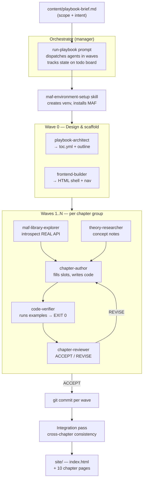

# Microsoft Agent Framework — Interactive Playbook

An interactive, multi-page HTML playbook that teaches the **Microsoft Agent Framework (MAF)** —
starting from high-level theory ("what is an agent?") and progressively drilling into the real
library components, grounded in the **actually-installed `agent-framework` 1.9.0 API**.

What makes this repository interesting is not just the playbook itself, but **how it was produced**:
by a small **fleet of GitHub Copilot primitives** (custom agents, skills, instruction files, and a
driver prompt) that collaborate under an orchestrator in a wave-based pipeline.

> 💡 **Inspired by [*The Agentic SDLC Handbook* by Daniel Meppiel](https://danielmeppiel.github.io/agentic-sdlc-handbook/handbook/ch01-the-agentic-sdlc-thesis.html)** — in particular its [case study on agentic handbook writing](https://danielmeppiel.github.io/agentic-sdlc-handbook/case-study-handbook-writing.html). This project applies that thesis: composing **primitives** (agents + prompts + skills + instructions) into a squad that produces real software artifacts.

> 📖 **Read the playbook live:** <https://valentina-alto.github.io/microsoft-agent-framework-playbook-fleets-generated/>

> 🤖 **See the fleet in action:** an [**interactive orchestration wireframe**](https://valentina-alto.github.io/microsoft-agent-framework-playbook-fleets-generated/orchestration.html) animates the exact pipeline (design → research → author → verify → review) that produced this playbook.

---

## The idea behind the fleet

Writing a technical playbook well requires several *different* skills that rarely live in one
person — or one prompt — at the same time:

- Someone who understands **theory** and can explain concepts clearly.
- Someone who knows the **library** deeply and won't hallucinate API names.
- Someone who can **write** approachable prose.
- Someone who **runs the code** to prove every example works.
- Someone who **reviews** critically and catches mistakes.
- Someone who handles the **front-end** so it all reads as a coherent site.

Trying to do all of this in a single mega-prompt produces shallow, error-prone results: the model
guesses API signatures from stale training data, examples don't run, and quality drifts chapter to
chapter.

**So instead of one generalist, we built a team of specialists.** Each role is encoded as a
*primitive* — a small, focused configuration file — and an **orchestrator** dispatches them like a
manager runs a team, in repeatable **waves** (research → author → verify → review → integrate).

### Two principles that drive quality

1. **Ground truth over training memory.** A dedicated *MAF Library Explorer* introspects the real
   installed package (`agent-framework` 1.9.0) to extract exact class/function names. Every chapter
   is written against that ground truth — *not* against what the model "remembers" from blogs. This
   is critical: many public examples use outdated or invented APIs (`run_stream`, `ai_function`,
   `TextContent`…). The fleet verified the *real* names (`run(..., stream=True)`,
   `@agent_framework.tool`, …).

2. **Executable proof.** Every code example is a real `.py` file that a *Code Verifier* runs in the
   project's virtual environment. Examples are credential-guarded so they **exit 0 without any API
   keys** — proving the structure compiles and imports resolve, even offline.

---

## The fleet roster

All primitives live under [`.github/`](.github/) following GitHub Copilot conventions.

| Primitive | Type | Role |
| --- | --- | --- |
| `playbook-architect` | agent | Designs the table of contents and chapter outline from the brief. |
| `theory-researcher` | agent | Researches high-level concepts from Microsoft docs; writes theory notes. |
| `maf-library-explorer` | agent | **Introspects the installed MAF library** to extract the real 1.9.0 API surface. |
| `chapter-author` | agent | Writes chapter prose + code into the HTML page slots. |
| `code-verifier` | agent | Runs every example in `.venv`, ensures EXIT 0 without credentials. |
| `chapter-reviewer` | agent | Reviews chapters for accuracy, consistency, and pitfalls (ACCEPT / REVISE). |
| `frontend-builder` | agent | Scaffolds the HTML shell, nav, styling, and final cross-links. |
| `maf-environment-setup` | skill | Reproducible recipe to create the venv and install the MAF packages. |
| `playbook-orchestration` | skill | The wave-based pipeline definition the orchestrator follows. |
| `playbook-content` | instructions | Auto-applied content/style rules for every chapter. |
| `maf-code-examples` | instructions | Auto-applied rules for writing runnable, credential-guarded examples. |
| `run-playbook` | prompt | The master driver prompt that boots and coordinates the whole fleet. |

**Inputs that steer the fleet:** [`content/playbook-brief.md`](content/playbook-brief.md) (scope) and
[`content/toc.yml`](content/toc.yml) (chapter spec / source of truth).

---

## How it works — the flow



### The wave loop, in words

1. **Setup.** The orchestrator builds a Python venv and installs the MAF packages so the library can
   be introspected and examples can run.
2. **Wave 0 — design.** The *architect* turns the brief into a concrete table of contents; the
   *frontend-builder* scaffolds the HTML shell with empty content slots.
3. **Content waves.** For each group of chapters, the *library-explorer* extracts the real API, the
   *theory-researcher* gathers concepts, the *author* fills the page slots and writes example code,
   the *verifier* runs every example (must exit 0 with no keys), and the *reviewer* signs off
   (routing REVISE notes back to the author until ACCEPT).
4. **Commit per wave.** Each completed wave is committed, keeping a clean, auditable history.
5. **Integration pass.** A final cross-chapter review checks navigation, terminology, progression,
   and API consistency across all chapters.

The orchestrator overlaps work where safe (e.g. researching the next wave while reviewing the
current one) and batches reviews to cut dispatch overhead.

---

## Repository layout

```
.github/
  agents/         # 7 specialist custom agents
  skills/         # environment setup + orchestration pipeline
  instructions/   # auto-applied content & code-example rules
  prompts/        # run-playbook driver + new-chapter helper
content/
  playbook-brief.md   # scope / intent
  toc.yml             # chapter spec (source of truth)
  research/           # per-chapter theory + library notes
backend/
  examples/           # runnable, credential-guarded .py per chapter
  requirements.lock.txt
site/
  index.html
  chapters/*.html     # 10 chapter subpages
  assets/             # style.css + app.js
scripts/
  run-fleet.ps1       # convenience launcher
```

---

## Run the playbook locally

```powershell
# from the repository root
cd site
..\.venv\Scripts\python.exe -m http.server
# then open http://localhost:8000
```

To re-run example code (no API key required — examples are credential-guarded):

```powershell
$env:PYTHONWARNINGS = 'ignore'
.\.venv\Scripts\python.exe backend\examples\ch05\tools_demo.py
```

> **Note:** examples must be run with the project's `.venv` interpreter, which has
> `agent-framework` **1.9.0**. A different global Python install may have an older version and will
> not match the documented API.

---

## Chapter arc

Theory → library → operations → hosting:

1. What is an agent?
2. Agentic patterns & the MAF map
3. Agents & instructions
4. Chat clients, messages & conversations
5. Tools & function calling
6. Workflows (sequential / concurrent)
7. Handoff & group chat
8. Streaming, checkpointing & human-in-the-loop
9. Middleware & observability
10. Declarative agents, hosting & DevUI

---

## Credits & inspiration

This repository is a direct application of **[*The Agentic SDLC Handbook* by Daniel Meppiel](https://danielmeppiel.github.io/agentic-sdlc-handbook/handbook/ch01-the-agentic-sdlc-thesis.html)** — the primary source of inspiration for the approach used here. The handbook's [case study on writing a handbook with agents](https://danielmeppiel.github.io/agentic-sdlc-handbook/case-study-handbook-writing.html) directly motivated the "fleet of primitives" model: encoding distinct roles as agents, prompts, skills, and instruction files, and orchestrating them in waves to produce verified artifacts.

The playbook content itself is grounded in the official **[Microsoft Agent Framework documentation](https://learn.microsoft.com/agent-framework/)** and the installed `agent-framework` Python package.

---

*Built by a fleet of GitHub Copilot primitives, orchestrated wave by wave, with every API grounded
in the installed library and every example proven to run.*
