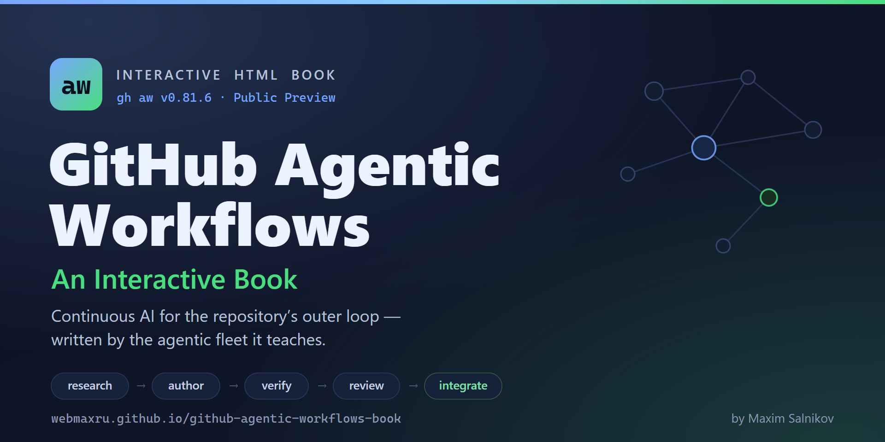
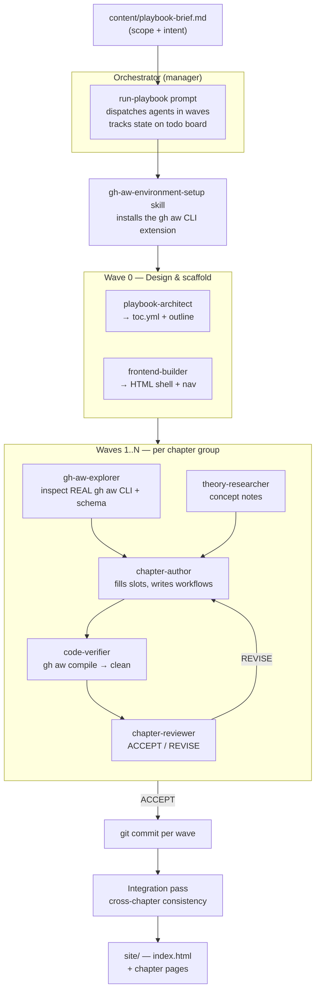

<p align="center">
  <a href="https://aw.isainative.dev/">
    
  </a>
</p>

<p align="center">
  <a href="https://aw.isainative.dev/"><strong>Read the book →</strong></a>
</p>

# GitHub Agentic Workflows — An Interactive Book

An interactive, multi-page HTML book that teaches **GitHub Agentic Workflows (gh-aw)** — starting
from high-level theory ("what is an agentic workflow?") and progressively drilling into the real
product: authoring natural-language Markdown workflows, compiling them with the **`gh aw` CLI**,
wiring up MCP tools, gating writes with safe outputs, and hosting on GitHub Actions.

What makes this repository interesting is not just the book itself, but **how it is produced**: by a
small **fleet of GitHub Copilot primitives** (custom agents, skills, instruction files, and a driver
prompt) that collaborate under an orchestrator in a wave-based pipeline.

> 💡 **Inspired by [*The Agentic SDLC Handbook* by Daniel Meppiel](https://danielmeppiel.github.io/agentic-sdlc-handbook/handbook/ch01-the-agentic-sdlc-thesis.html)** — in particular its [case study on agentic handbook writing](https://danielmeppiel.github.io/agentic-sdlc-handbook/case-study-handbook-writing.html). This project applies that thesis: composing **primitives** (agents + prompts + skills + instructions) into a squad that produces real software artifacts.

> 🧬 **Built on the foundation of [`microsoft-agent-framework-playbook-fleets-generated` by Valentina Alto](https://github.com/Valentina-Alto/microsoft-agent-framework-playbook-fleets-generated)** — this project adapts that repository's fleet-of-primitives methodology and site tooling from the **Microsoft Agent Framework** to **GitHub Agentic Workflows**.

> 🛠️ **Build & preview locally:** the site is generated from `content/toc.yml` by `site/generate.py`
> and served from `site/` (see [Run the book locally](#run-the-book-locally)). Published at <https://aw.isainative.dev/>.

---

## The idea behind the fleet

Writing a technical book well requires several *different* skills that rarely live in one
person — or one prompt — at the same time:

- Someone who understands **theory** and can explain concepts clearly.
- Someone who knows the **product** deeply and won't hallucinate CLI flags or frontmatter fields.
- Someone who can **write** approachable prose.
- Someone who **runs the examples** to prove every workflow compiles.
- Someone who **reviews** critically and catches mistakes.
- Someone who handles the **front-end** so it all reads as a coherent site.

Trying to do all of this in a single mega-prompt produces shallow, error-prone results: the model
guesses syntax from stale training data, examples don't compile, and quality drifts chapter to
chapter.

**So instead of one generalist, we built a team of specialists.** Each role is encoded as a
*primitive* — a small, focused configuration file — and an **orchestrator** dispatches them like a
manager runs a team, in repeatable **waves** (research → author → verify → review → integrate).

### Two principles that drive quality

1. **Ground truth over training memory.** A dedicated *gh-aw Explorer* inspects the **real `gh aw`
   CLI and the workflow frontmatter schema** to extract exact commands, flags, and fields. Every
   chapter is written against that ground truth — *not* against what the model "remembers" from
   blogs. This is critical: agentic tooling moves fast, and public examples often use outdated or
   invented syntax. The fleet verifies the *real* surface (`gh aw compile`, `safe-outputs:`,
   `engine:`, `tools:`, …) and records the inspected `gh aw` version.

2. **Executable proof.** Every workflow example is a real Markdown file that a *Code Verifier*
   compiles with `gh aw compile`. Examples are designed to **compile cleanly without any engine
   secrets** — proving the frontmatter is valid and the workflow lowers to a `*.lock.yml`, even
   offline.

---

## The fleet roster

All primitives live under [`.github/`](.github/) following GitHub Copilot conventions.

| Primitive | Type | Role |
| --- | --- | --- |
| `playbook-architect` | agent | Designs the table of contents and chapter outline from the brief. |
| `theory-researcher` | agent | Researches high-level concepts from the gh-aw docs; writes theory notes. |
| `gh-aw-explorer` | agent | **Inspects the real `gh aw` CLI + frontmatter schema** to extract the true surface. |
| `chapter-author` | agent | Writes chapter prose + workflow examples into the HTML page slots. |
| `code-verifier` | agent | Compiles every example with `gh aw compile`; ensures a clean compile without secrets. |
| `chapter-reviewer` | agent | Reviews chapters for accuracy, consistency, and pitfalls (ACCEPT / REVISE). |
| `frontend-builder` | agent | Scaffolds the HTML shell, nav, styling, and final cross-links. |
| `gh-aw-environment-setup` | skill | Reproducible recipe to install the `gh aw` CLI extension and verify it. |
| `playbook-orchestration` | skill | The wave-based pipeline definition the orchestrator follows. |
| `playbook-content` | instructions | Auto-applied content/style rules for every chapter. |
| `gh-aw-workflow-examples` | instructions | Auto-applied rules for writing compilable workflow examples. |
| `run-playbook` | prompt | The master driver prompt that boots and coordinates the whole fleet. |

**Inputs that steer the fleet:** [`content/playbook-brief.md`](content/playbook-brief.md) (scope) and
[`content/toc.yml`](content/toc.yml) (chapter spec / source of truth).

---

## How it works — the flow



### The wave loop, in words

1. **Setup.** The orchestrator installs the `gh aw` CLI extension so the product surface can be
   introspected and examples can be compiled.
2. **Wave 0 — design.** The *architect* turns the brief into a concrete table of contents; the
   *frontend-builder* scaffolds the HTML shell with empty content slots.
3. **Content waves.** For each group of chapters, the *gh-aw explorer* extracts the real CLI/schema,
   the *theory-researcher* gathers concepts, the *author* fills the page slots and writes example
   workflows, the *verifier* compiles every example (must compile clean with no secrets), and the
   *reviewer* signs off (routing REVISE notes back to the author until ACCEPT).
4. **Commit per wave.** Each completed wave is committed, keeping a clean, auditable history.
5. **Integration pass.** A final cross-chapter review checks navigation, terminology, progression,
   and syntax consistency across all chapters.

The orchestrator overlaps work where safe (e.g. researching the next wave while reviewing the
current one) and batches reviews to cut dispatch overhead.

---

## Repository layout

```
.github/
  agents/         # 7 specialist custom agents
  skills/         # gh aw environment setup + orchestration pipeline
  instructions/   # auto-applied content & workflow-example rules
  prompts/        # run-playbook driver + new-chapter helper
content/
  playbook-brief.md   # scope / intent
  toc.yml             # chapter spec (source of truth)
  outline.md          # architect's working outline
  research/           # per-chapter theory + capability notes (generated by the fleet)
examples/             # compile-verified .md workflow examples (generated by the fleet)
site/
  generate.py         # scaffolds the site from content/toc.yml
  index.html          # generated
  chapters/*.html     # generated: one page per chapter in toc.yml
  assets/             # style.css + app.js + analytics.js (built beacon)
analytics/
  analytics.entry.js  # cookieless App Insights beacon source (bundled → site/assets/analytics.js)
azure/
  dashboard.json      # Portal engagement dashboard (ARM template)
package.json          # analytics build tooling (esbuild bundle + report command)
scripts/
  run-fleet.ps1       # convenience launcher
  report.ps1          # engagement report (PowerShell)
```

> The book content itself (`content/research/`, `examples/`, generated `site/` pages) is produced by
> the fleet. This repository ships the **infrastructure**; run the fleet to build the book.

---

## Run the book locally

The site is a static, generated artifact. Regenerate it from the table of contents, then serve it:

```powershell
# from the repository root — requires Python 3.10+ and PyYAML
pip install pyyaml
python site/generate.py

cd site
python -m http.server
# then open http://localhost:8000
```

To verify a workflow example, compile it with the `gh aw` CLI (no engine secret required — examples
compile to a `*.lock.yml`):

```powershell
# install once
gh extension install github/gh-aw

# compile an example workflow
gh aw compile examples/<chapter>/<workflow>.md
```

> **Note:** `gh aw compile` validates frontmatter and lowers the Markdown workflow into a GitHub
> Actions lock file. Running a workflow for real (`gh aw run`) needs an engine configured in GitHub
> Actions secrets; the book's examples are written to compile cleanly without that.

---

## Privacy-friendly analytics (cookieless RUM)

The published site is instrumented with **cookieless Real User Monitoring** via Azure Application
Insights, using [`@webmaxru/cookieless-insights`](https://www.npmjs.com/package/@webmaxru/cookieless-insights).
It uses **no cookies, no local/session storage, and no persistent identifier** — so there is **no
consent banner** — and stays inside Azure's **free tier** (workspace-based, 30-day retention,
0.16 GB/day cap). Telemetry is sent with the browser **beacon** transport (`navigator.sendBeacon`).

**How it's wired**

- `analytics/analytics.entry.js` is the beacon source — it initializes tracking, records an
  automatic **page view**, and wires **key interactions** (theme change, sidebar toggle, code copy,
  in-page section nav, internal/outbound link clicks, "opened via shared link", and debounced
  input changes for any sliders/typing). It is bundled to `site/assets/analytics.js` with esbuild:
  ```powershell
  npm ci
  npm run build:analytics
  ```
- The Application Insights **connection string is a public client key**, injected at **build time**,
  never committed as source. `site/generate.py` reads the `APPINSIGHTS_CONNECTION_STRING`
  environment variable and embeds it into each page's `<head>` as
  `window.__APPINSIGHTS_CONNECTION_STRING__`; the beacon reads that global. The committed HTML
  carries an **empty** string (a safe no-op).
- In CI (`.github/workflows/deploy-pages.yml`) the value comes from the repository **Actions
  variable** `APPINSIGHTS_CONNECTION_STRING` (Settings → Secrets and variables → Actions →
  Variables — *not* a secret), forwarded into the site-generation step and injected only into the
  `gh-pages` build. The one line the deploy job needs on its **Regenerate site from content** step:
  ```yaml
  env:
    APPINSIGHTS_CONNECTION_STRING: ${{ vars.APPINSIGHTS_CONNECTION_STRING }}
  ```
  Until that env line is present, the published HTML carries an empty string and analytics stays a
  safe no-op.

**Kill switch (one line).** Flip the constant at the top of `analytics/analytics.entry.js` and
rebuild:

```js
const ANALYTICS_ENABLED = false; // disables all telemetry
```

Clearing the `APPINSIGHTS_CONNECTION_STRING` repo variable (empty string) also disables tracking on
the next deploy — `init()` self-disables when the connection string is empty.

**Engagement report & dashboard**

```powershell
# print engagement (page views, sessions, per-visit dwell, key events, top pages, geo, browser/OS)
npm run report                       # wraps the command below and opens the Portal dashboard
npx cookieless-insights report --resource-group is-ai-native-rg --app-insights aw-book-ai --days 30
# PowerShell equivalent
./scripts/report.ps1 -ResourceGroup is-ai-native-rg -AppInsights aw-book-ai
```

The Azure Portal **engagement dashboard** (`azure/dashboard.json`) is deployed in resource group
`is-ai-native-rg`. Data appears within ~1–3 minutes of a real visit.

---


The concrete chapter map is **designed by `playbook-architect`** from
[`content/playbook-brief.md`](content/playbook-brief.md) and recorded in
[`content/toc.yml`](content/toc.yml). The intended progression is theory → authoring → capabilities
→ hosting:

> Indicative shape (the architect finalizes the real chapters):
> what agentic workflows are → the gh-aw workflow model (Markdown + frontmatter) → the `gh aw` CLI →
> triggers & engines → MCP tools → safe outputs → permissions, network & strict mode → shared
> components & repo memory → debugging & CI hosting.

Until the architect runs, `content/toc.yml` is intentionally empty and the site scaffolds to a
placeholder home page.

---

## Credits & inspiration

This repository is directly built upon **[`microsoft-agent-framework-playbook-fleets-generated` by Valentina Alto](https://github.com/Valentina-Alto/microsoft-agent-framework-playbook-fleets-generated)**, which served as the foundation for this project. That repository pioneered the "fleet of primitives" playbook applied to the **Microsoft Agent Framework**; this project adapts its orchestration methodology, fleet structure, and site tooling to teach **GitHub Agentic Workflows** instead.

The approach itself is a direct application of **[*The Agentic SDLC Handbook* by Daniel Meppiel](https://danielmeppiel.github.io/agentic-sdlc-handbook/handbook/ch01-the-agentic-sdlc-thesis.html)** — the primary source of inspiration behind it. The handbook's [case study on writing a handbook with agents](https://danielmeppiel.github.io/agentic-sdlc-handbook/case-study-handbook-writing.html) directly motivated the "fleet of primitives" model: encoding distinct roles as agents, prompts, skills, and instruction files, and orchestrating them in waves to produce verified artifacts.

The book content itself is grounded in the official **[GitHub Agentic Workflows documentation](https://github.github.com/gh-aw/)** and the installed **[`gh aw` CLI extension](https://github.com/github/gh-aw)**.

---

*Built by a fleet of GitHub Copilot primitives, orchestrated wave by wave, with every command
grounded in the installed `gh aw` CLI and every example proven to compile.*
